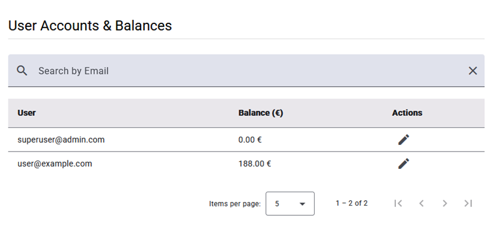
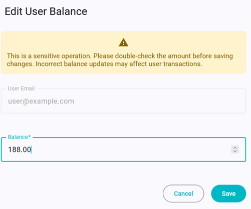

# ADMIN - Manage Accounts

This view shows a table with all users' accounts registered into Zap. They can be **filtered** by email and edit its balance.

After clicking on the pencil icon in a row, a form will appear to edit the balance. The balance must be a positive number.

