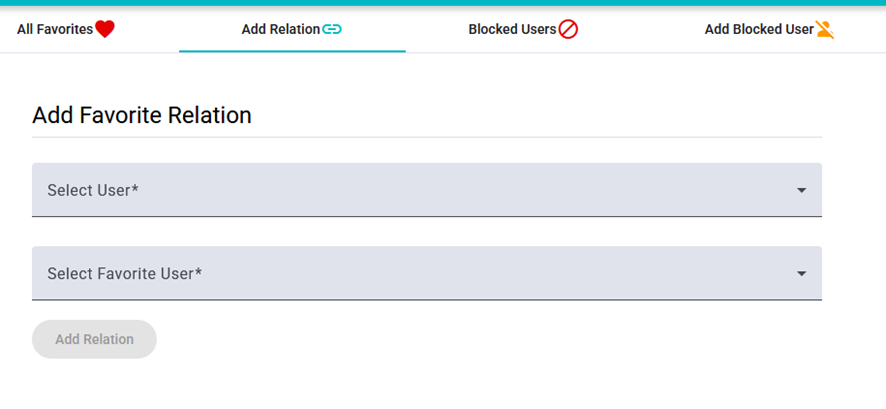

# ADMIN - Manage Relationships

There are four tabs for managing favorite relationships and blocked users.

- **All Favorites**: This tab shows all the favorite relationships between users.
- **Add Relation**: This tab allows you to add a favorite relationship between two users.
- **Blocked Users**: This tab shows all the blocked users.
- **Add Blocked User**: This tab allows you to add a blocked user.

To add a favorite relationship between two users, search their emails. Then, click on “Add Relation” to add it. To remove it, go to the “Favorites” tab and click on the heart-filled icon. For blocking a user, the process will be the same.

