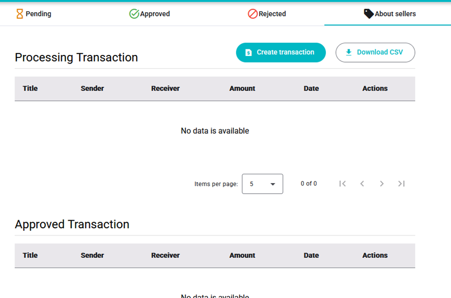

# ADMIN - Manage Transactions

There are four tabs for the different status and an extra one for managing sellers' transactions that are a bit special.

Inside pending, approved, and rejected tabs there’s a table with the corresponding transactions. Depending on the table, the actions that can be performed on a transaction will be different, but they will change its status.

## Create Transaction as Admin

To create a transaction on behalf of a user:

1. Introduce sender’s email and receiver’s email. Administrator is supposed to know system’s terminology, so remember that “sender” is the one who sends the money and “receiver” is the one who receives it.
2. Introduce the amount and select the type of transaction: if the user wants to send money or request it. Type "send” implies that the money is automatically withdrawn from the user’s account while on type "request” the money is moved when the transaction is approved.
3. Introduce title and optionally a description.
4. Confirm the transaction data. If everything is correct, a transaction with pending state will be created.

