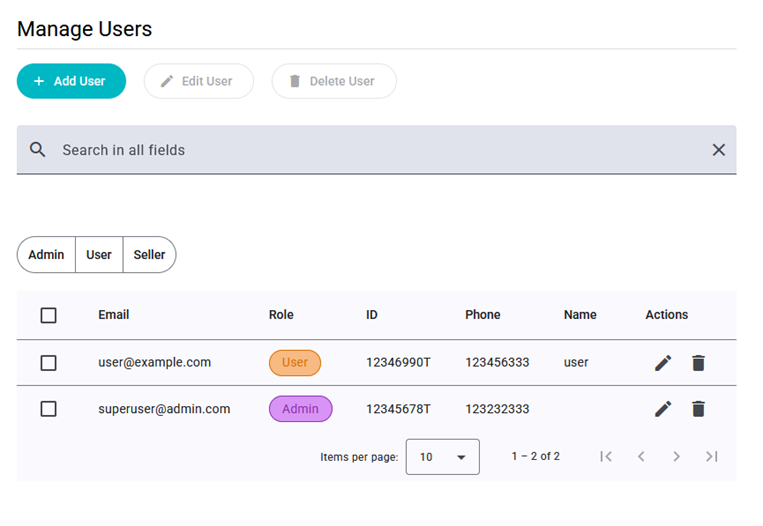
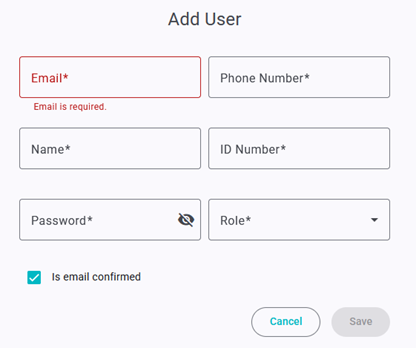

# ADMIN - Manage Users

This view shows a table with all users registered into Zap. They can be **filtered** by role or using the search bar by name or email (as this is unique). Each row of the table includes buttons to edit or delete the user. You can also select a user using the table’s checkboxes.

You can only **edit** one user at a time, but multiple users can be deleted at the same time. Select all of them using the checkboxes and click on **“Delete user”** button on top of the page.

If we click on **“Add user”** this form will appear. Similar to user’s registration form, fields information must be correct before saving the changes. Additionally, a box is checked by default, the user can’t log in until this is checked. For editing a user, we use the same form but be aware that the email can’t be changed.

