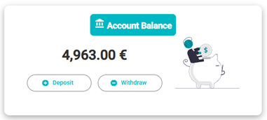
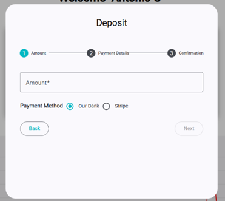
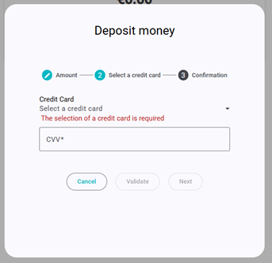
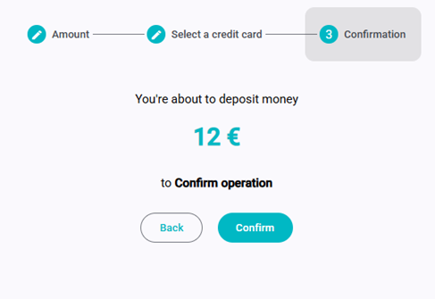

# Homepage

The homepage allows deposits or withdrawals using a credit card.



Steps:
1. Click **Deposit** or **Withdraw**.
2. Select the **amount**.  



3. Choose a **credit card** and enter the **CVV**.


   - If you have not added a credit card, go to the **Settings** page and add a new card.
    - If you have added a card, select it from the list.
4. Confirm the operation.


If there are insufficient funds during withdrawal, an error will appear. Otherwise, the operation completes successfully.

You can also perform the same actions using **Stripe** with the same flow.

> [!IMPORTANT]
> You need to have a **Stripe** account to use this feature.

Define into main backend, in the **.env** file
```env
SECRET_KEY_STRIPE=your-stripe-secret-key
```
Define in the frontend the public key, in the **.envirnonment** file
```env
PUBLIC_STRIPE_KEY=your-stripe-public-key
```
