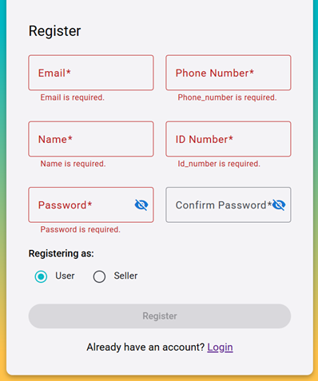
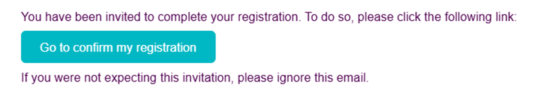
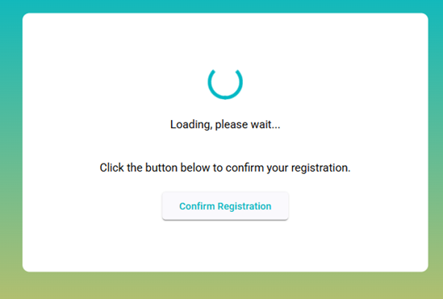
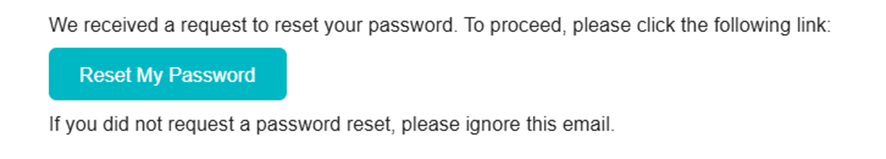
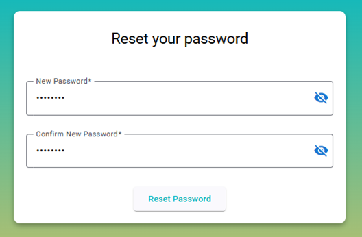

# Register and Login

## Register process

To use **Zap**, the user must register to be in our user database. The required fields are:

- **Email**: Must contain `@` followed by a letter.
- **Phone Number**: Only Spanish prefixes are accepted (9 digits total).
- **Name**: Any value is allowed.
- **ID Number**: Assumed to be a DNI (8 digits followed by a letter).
- **Password**: Minimum 8 characters, at least one uppercase letter and one number.
- **Confirm Password**: Must match the password field.
- **Role**: Choose between `User` or `Seller` (different available features).

The **Register** button will remain disabled until all fields are correctly filled in. Field-specific guidance is provided during input.

After registering, users will receive a **confirmation email**. Without confirmation, login is not possible.

## Login process

To log in, users need to provide their **email** and **password**. The login button activates when both are filled.

For password recovery, click on **"Forgot password"**, and you will receive an email with a link to reset your password.

