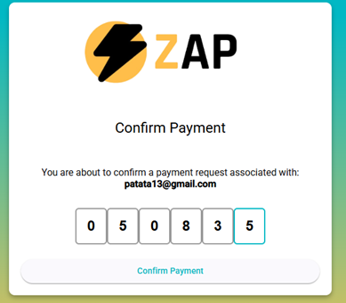

# Seller Guide to Payment Request

Sellers can only **ask for money** and view **received transactions**.

## Steps to Request Payment:
1. Click **Ask for money**.
2. Enter receivers email(s).
3. Select the amount, title, and optional description.
4. Confirm the request.
5. If everything is correct, the system will create a transaction with status **"Processing"**.

The recipient receives an **email with a login link**:
- Email is pre-filled.
- User enters password.
- Receives a **confirmation code** by email.
- Enter the code to complete payment.

⚠️ The **confirmation code is one-time use**. Once confirmed, the transaction status changes from **"Processing"** to **"Approved"**.

