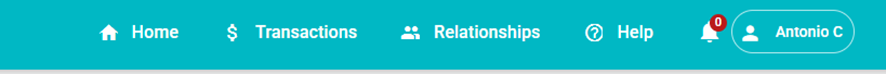
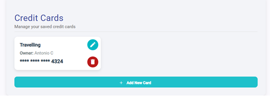
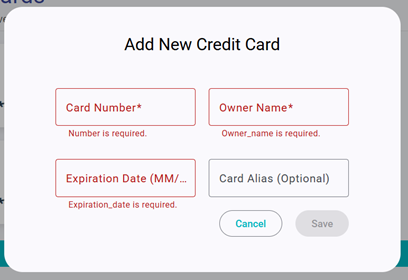

# Toolbar and Settings

Users can navigate to different pages using the **toolbar**.

- Sellers **do not see** the "Relationships" button.
- A **bell icon** displays the number of pending transactions.

To access **account settings**, hover over your name and click **Settings**.

In settings, users can:
- **Modify email or phone number** (restrictions apply, same as during registration).
- **Change password**.
- **Delete your account** (requires confirmation).

## Credit Cards Management

You can **add, edit, or delete** credit cards for deposits or withdrawals. Note: cards can only be used with the **"Our bank"** option during deposit.

To add a credit card the following information is needed:
- **Card Number**: 16-digit number.
- **Owner Name**: As appears on the card (not necessarily the user name).
- **Expiration Date**: Format `MM/YY`.
- **Card Alias**: Optional, to help identify cards.

⚠️ The **CVV is not stored** and will be asked again during operations.

