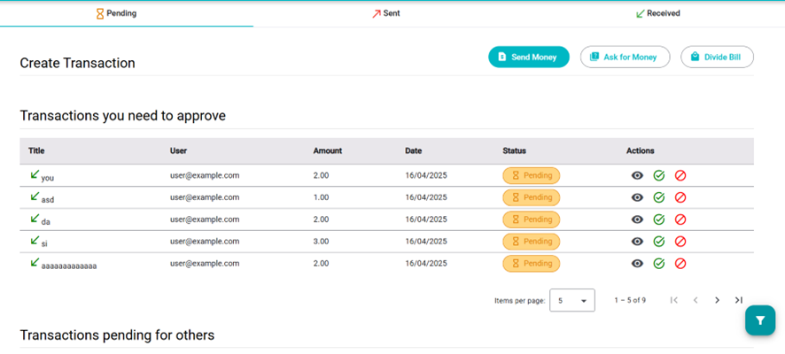

# Transactions

Users can **send**, **receive**, **accept**, or **reject** transactions.

## Tabs:
- **Pending**: View transactions requiring action.
- **Sent**: Completed transactions where you sent money.
- **Received**: Completed transactions where you received money.

## Pending Transactions Breakdown:

- **Transactions you need to approve**:
  - Requests from others.
  - Sent transactions awaiting your validation.
- **Transactions pending for others**:
  - Transactions you've sent or requested from others (view only).

## Available Actions:
- **Send money**:
  - Input emails (favorites are suggested).
  - Confirm to send money (withdrawn immediately).
- **Ask for money**:
  - Input emails.
  - Funds will be added only once approved by others.
- **Divide bill**:
  - Enter total amount.
  - The system calculates and requests the correct amount from each person.
